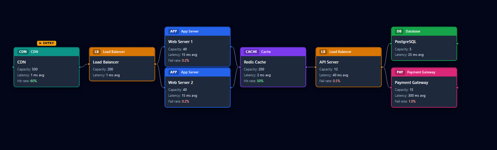

# NetworkSim

A visual, interactive network architecture simulator. Drag nodes onto a canvas, wire them together, configure latency and failure rates, and run a discrete-event simulation — no code or JSON editing required.



---

## Features

- **Visual canvas editor** — drag-and-drop nodes, draw connections, delete with the `Delete` key
- **7 node types** — Load Balancer, App Server, Database, Cache, CDN, Message Queue, Payment Gateway
- **Realistic service times** — log-normal distribution (empirically accurate for network/DB latency)
- **Per-node configuration** — capacity, latency (mean + std dev), failure rate, queue timeout, cache hit rate, per-request-type processing profiles
- **Inter-node link latency** — click any wire to add a propagation delay (e.g. 65ms cross-region)
- **Flexible routing** — First, Round Robin, Random, or Weighted (arbitrary weights) when a node has multiple outgoing edges
- **Fan-out / scatter-gather** — mark any node to dispatch child requests to all branches in parallel; parent completes only when every branch finishes
- **Scheduled outages** — configure `↓ start – end` windows per node; the engine brings nodes down and back up mid-simulation
- **Traffic control** — Poisson arrivals at a configurable rate, plus an optional burst multiplier over a time window (flash-sale simulation)
- **Rich metrics** — total/completed/failed/timed-out counts, avg/p50/p95/p99 latency, per-node utilization bars and queue size, per-request-type breakdown
- **Canvas overlays** — nodes display a color-coded utilization badge after every run (green < 60%, amber < 80%, red ≥ 80%)
- **6 built-in presets** — ready-to-load architectures covering common real-world patterns
- **JSON export** — download the full simulation summary with one click
- **Headless CLI** — run scenarios from the terminal without the UI

---

## Built-in Presets

| Preset | Description |
|---|---|
| `simple_web_stack` | LB → App Server → Database |
| `cached_web_stack` | LB → App → Cache (80% hit rate) → Database |
| `parallel_app_servers` | LB (round-robin) → 3 App Servers → Database |
| `microservices` | API Gateway → Auth Service → Business Logic → Database |
| `ecommerce_storefront` | CDN → LB → 2 Web Servers → Redis → API Server → PostgreSQL / Payment Gateway (weighted 90/10). Designed for burst × 5 flash-sale testing at 300 req/s. |
| `scatter_gather_api` | API Gateway (fan-out) → Auth Service + Product Service → their own databases. Demonstrates that end-to-end latency = max(branch latencies), not the sum. |

---

## Tech Stack

| Layer | Technology |
|---|---|
| Frontend | React 19, TypeScript, Vite |
| Canvas | `@xyflow/react` (React Flow v12) |
| Styling | Tailwind CSS v4 |
| Backend | FastAPI + Uvicorn |
| Simulation engine | Pure Python, discrete-event simulation (min-heap) |
| Tests | pytest |

---

## Prerequisites

- **Python 3.10+**
- **Node.js 18+** and npm

---

## Installation

### 1. Clone the repository

```bash
git clone https://github.com/AdamCottonUMN/NetworkSim.git
cd NetworkSim
```

### 2. Install Python dependencies

```bash
pip install -r requirements.txt
```

### 3. Install frontend dependencies

```bash
cd frontend
npm install
cd ..
```

---

## Running the App

You need two terminals running simultaneously.

**Terminal 1 — backend**
```bash
uvicorn backend.main:app --reload --port 8001
```

> The API is served at `http://localhost:8001`. Port 8000 is reserved by Hyper-V on Windows; use 8001 (or any free port — update the `vite.config.ts` proxy target to match).

**Terminal 2 — frontend**
```bash
cd frontend
npm run dev
```

Open `http://localhost:5173` in your browser.

---

## Usage

1. **Build an architecture** — drag node types from the left palette onto the canvas, then draw connections between them by dragging from a node's right handle to another's left handle.
2. **Configure nodes** — click any node to open the properties panel on the right. Set capacity, latency, failure rate, timeouts, cache hit rate, outage windows, and routing strategy.
3. **Configure edges** — click any wire to set a link latency (propagation delay in ms).
4. **Set traffic parameters** — use the bottom bar to set request rate (req/s), simulation duration (s), random seed, and an optional burst window.
5. **Run** — hit the **Run** button. Results appear in the panel at the bottom; nodes on the canvas update with utilization badges.
6. **Load a preset** — use the **Load Preset** dropdown in the toolbar to instantly populate the canvas with a reference architecture.
7. **Export** — click **Export JSON** in the results panel to download the full metrics summary.

---

## Headless CLI

Run predefined scenarios without the UI:

```bash
python run_simulation.py
```

This runs three back-to-back scenarios (normal load, high load, cached high load) and prints a formatted summary to stdout — useful for quick benchmarks or CI checks.

---

## Project Structure

```
NetworkSim/
├── simulator/              # Discrete-event simulation engine
│   ├── engine.py           # Main event loop, fan-out, outage scheduling
│   ├── node.py             # Node model, log-normal service time sampling
│   ├── architecture.py     # Graph structure, routing, link latency
│   ├── request.py          # Request state machine
│   ├── metrics.py          # Metrics collector, percentiles, time-series
│   ├── sla.py              # SLA checking helpers
│   └── export.py           # Summary export utilities
├── traffic/
│   └── generators.py       # Poisson and burst arrival generators
├── backend/
│   ├── main.py             # FastAPI app (3 endpoints)
│   └── models.py           # Pydantic request/response models
├── frontend/
│   └── src/
│       ├── App.tsx          # Root layout, global state
│       ├── api.ts           # Fetch helpers
│       ├── types.ts         # Shared TypeScript types
│       ├── nodes/           # Custom React Flow node components
│       └── components/      # Palette, config panels, toolbar, results
├── configs/
│   └── default_architectures.json   # Built-in preset definitions
├── tests/
│   └── test_engine.py       # 73 pytest tests for the simulation engine
└── run_simulation.py        # Headless CLI entry point
```

---

## API Reference

The backend exposes three endpoints:

| Method | Path | Description |
|---|---|---|
| `GET` | `/api/health` | Returns `{"status": "ok"}` |
| `GET` | `/api/presets` | Returns the list of built-in architecture configs |
| `POST` | `/api/simulate` | Runs a simulation and returns metrics |

### `POST /api/simulate`

**Request body**

```jsonc
{
  "nodes": [
    {
      "id": "lb",
      "name": "Load Balancer",
      "capacity": 100,
      "mean_processing_time": 0.003,   // seconds
      "std_processing_time": 0.001,
      "failure_rate": 0.0,
      "hit_rate": 0.0,                 // cache/CDN nodes only
      "timeout": null,                 // queue timeout in seconds, or null
      "processing_profiles": {},       // { "request_type": [mean, std] }
      "fan_out": false,
      "outages": [
        { "start": 30.0, "duration": 10.0 }
      ]
    }
  ],
  "edges": [["lb", "app"], ["app", "db"]],
  "entry_node_id": "lb",
  "routing": {
    "lb": { "strategy": "round_robin" },
    "app": { "strategy": "weighted", "weights": { "db": 9, "payment": 1 } }
  },
  "link_latency": [["app", "db", 0.065]],   // [from, to, seconds]
  "rate": 100,                               // requests per second
  "duration": 60,                            // simulated seconds
  "seed": 42,
  "burst": {
    "start": 10.0,
    "end": 20.0,
    "multiplier": 5.0
  }
}
```

**Response**

```jsonc
{
  "summary": {
    "total_requests": 6000,
    "completed": 5940,
    "failed": 60,
    "timed_out": 12,
    "failure_rate": 0.01,
    "avg_latency_ms": 87.4,
    "p50_latency_ms": 81.2,
    "p95_latency_ms": 163.5,
    "p99_latency_ms": 241.0,
    "by_type": { ... },
    "node_metrics": {
      "db": {
        "arrivals": 5940,
        "completions": 5940,
        "failures": 0,
        "avg_utilization": 0.74,
        "avg_queue_size": 2.1,
        "max_queue_size": 8
      }
    }
  }
}
```

---

## Adding a Custom Preset

Add an entry to `configs/default_architectures.json` following the same schema as the existing presets. The `entry_node_id` must match one of the node `id` values. The preset appears immediately in the UI's **Load Preset** dropdown on next page load.

---

## Running Tests

```bash
pytest tests/
```

73 tests cover the simulation engine: basic routing, queueing, failure modes, timeouts, cache hit/miss, round-robin, weighted routing, fan-out/scatter-gather, link latency, and outage scheduling.

---

## Contributing

1. Fork the repository and create a feature branch.
2. Make your changes. Keep simulation logic in Python (`simulator/`); keep UI logic in the React frontend.
3. Add or update tests in `tests/test_engine.py` for any engine changes.
4. Ensure all tests pass (`pytest tests/`) and the frontend builds cleanly (`cd frontend && npm run build`).
5. Open a pull request with a clear description of what you changed and why.

---

## License

This project is licensed under the [MIT License](LICENSE).
